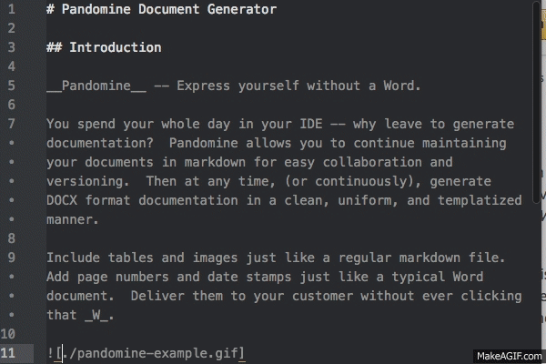

# Pandomine Document Generator

## Introduction

__Pandomine__ -- Express yourself without a Word.

You spend your whole day in your IDE -- why leave to generate documentation?  Pandomine allows you to continue maintaining your documents in markdown for easy collaboration and versioning.  Then at any time, (or continuously), generate DOCX format documentation in a clean, uniform, and templatized manner.

Include tables and images just like a regular markdown file.  Add page numbers and date stamps just like a typical Word document.  Deliver them to your customer without ever clicking that _W_.

## Demo

1. Install pandoc.
2. Clone this repo.
3. Run `./generate-docs.sh`
4. Pandomime finds three README.md files and generates docs.
5. View your fresh, new DOCX files in the docs/ directory.

## Requirements

Pandomine uses `pandoc` for document conversion. You can grab it at [pandoc.org](http://pandoc.org/).

`pandoc` uses a reference template when generating the DOCX files.  This is an existing DOCX file that has the desired formatting including headers and footers.  When constructing this file, make sure any date fieldss are configured to update automatically.  Without a reference template, `pandoc` uses the default document settings for Word.

## How It Works

Run `generate_docs.sh` from the any directory.  It will drill down into all subdirectories and do the following:

1. Find any files named `README.md`
2. Extract out the first __First Level Header (#)__ in the document to use as the document title.
3. Generate a DOCX file by combining the markdown from the file and formatting from the reference document specified in the configuration.
4. Save the DOCX file in the document subdirectory specified in configuration using the name extracted above.
5. Continue on to the next `README.md` file.

## Configuration

`generate-docs.sh` uses three constants:

* __pandoc_path__ -- Location of pandoc installed on this machine.
* __reference_path__ -- Location of reference DOCX file.
* __document_dir__ -- Relative subdirectory for document files.

`README.md` is always assumed as the name of the markdown input files.
